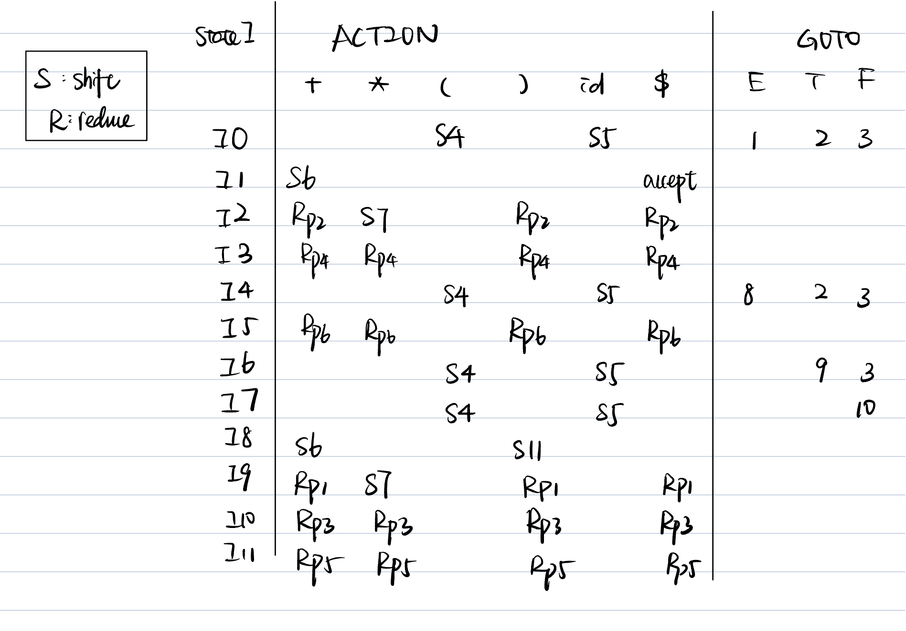

# expression-compiler
Compiler construction intro tutorial - build a simple expression compiler

## Lex-ing

## Parsing

### LL(1)
```
E -> E + E
E -> E - E
E -> E * E
E -> NUM
E -> (E)
```
1. Ambiguous CFG, causes problems when try to go from program texts to derivation tree because of semantic ambiguity.
   - e.g., parse 17 + 3 * 4

```
E -> E + T (* T must have a higher or equal precedence as E *)
E -> E - T 
E -> T
T -> T * F (* F must have a higher or equal precedence as T *)
T -> F
F -> NUM
F -> (E)
```

2. Unique derivation tree but left-recursion

```
E -> TE'
E' -> +TE' | -TE' | ε
T -> FT'
T' -> *FT' | ε
F -> NUM
F -> (E)
```

3. Eliminated left-recursion and add a new start production, calculate FIRST and FOLLOW set

```
S -> E$ (* $ represents the end of the string *)
E -> TE'
E' -> +TE' | -TE'| ε
T -> FT'
T' -> *FT'| ε
F -> NUM
F -> (E)
```
- Calculate FIRST set:

```
Production       Iteration 1      Iteration 2      Iteration 3     Iteration 4
S -> E$            null             null            null             {NUM,(}
E -> TE'           null             null            {NUM,(}          {NUM,(}
E' -> +TE'         {+}              {+}             {+}              {+}
E' -> -TE'         {-}              {-}             {-}              {-}
E' -> ε            null             null            null             null
T -> FT'           null             {NUM,(}         {NUM,(}          {NUM,(}
T' -> *FT'         {*}              {*}             {*}              {*}
T' -> ε            null             null            null             null
F -> NUM           {NUM}            {NUM}           {NUM}            {NUM}
F -> (E)           {(}              {(}             {(}              {(}

Non-terminals
S                  null             null            null             {NUM,(}
E                  null             null            {NUM,(}          {NUM,(}
E'                 {+,-}            {+,-}           {+,-}            {+,-}
T                  null             {NUM,(}         {NUM,(}          {NUM,(}
T'                 {*}              {*}             {*}              {*}
F                  {NUM,(}          {NUM,(}         {NUM,(}          {NUM,(}

=> we get
FIRST(S) = {NUM,(}      NULLABLE(S) = False
FIRST(E) = {NUM,(}      NULLABLE(E) = False
FIRST(E') = {+,-}       NULLABLE(E') = True
FIRST(T) = {NUM,(}      NULLABLE(T) = False
FIRST(T') = {*}         NULLABLE(T') = True
FIRST(F) = {NUM,(}      NULLABLE(F) = False
```

- Calculate FOLLOW set:
```
Production       Constraints
S -> E$          {$} ⊆ FOLLOW(E), FOLLOW(S) ⊆ FOLLOW(E)
E -> TE'         FOLLOW(E) ⊆ FOLLOW(T), FOLLOW(E) ⊆ FOLLOW(E')
E' -> +TE'       FOLLOW(E') ⊆ FOLLOW(T)
E' -> -TE'       FOLLOW(E') ⊆ FOLLOW(T)
E' -> ε
T -> FT'         FOLLOW(T) ⊆ FOLLOW(F), FOLLOW(T) ⊆ FOLLOW(T')
T' -> *FT'       FOLLOW(T') ⊆ FOLLOW(F)
T' -> ε
F -> NUM         
F -> (E)         {)} ⊆ FOLLOW(E)

=> we get
FOLLOW(S) = {}
FOLLOW(E) = {),$}
FOLLOW(E') = {),$}
FOLLOW(T) = {),$}
FOLLOW(T') = {),$}
FOLLOW(F) = {),$}
```

4. Encode in a table or recursive-descent program
- Table: the production N -> a is in the table at (N,c) if c ∈ FIRST(a) or (NULLABLE(a) ⋀ c ∈ FOLLOW(N))

```
As a reference, the FIRST set and FOLLOW set (also the NULLABLE set):
FIRST(S) = {NUM,(}      NULLABLE(S) = False      FOLLOW(S) = {}
FIRST(E) = {NUM,(}      NULLABLE(E) = False      FOLLOW(E) = {),$}
FIRST(E') = {+,-}       NULLABLE(E') = True      FOLLOW(E') = {),$}
FIRST(T) = {NUM,(}      NULLABLE(T) = False      FOLLOW(T) = {),$}
FIRST(T') = {*}         NULLABLE(T') = True      FOLLOW(T') = {),$}
FIRST(F) = {NUM,(}      NULLABLE(F) = False      FOLLOW(F) = {),$}

The productions:
S -> E$         
E -> TE'        
E' -> +TE' 
E' -> -TE'    
E' -> ε
T -> FT'   
T' -> *FT'     
T' -> ε
F -> NUM         
F -> (E)   

Nt\t      +          -          *           NUM        (         )        $
S                                          S->E$     S->E$                         
E                                          E->TE'    E->TE'
E'      E'->+TE'   E'->-TE'                                     E'->ε   E'->ε
T                                          T->FT'    T->FT'
T'                            T'->*FT'                          T'->ε   T'->ε   
F                                          F->NUM    F->(E)

```

### SLR

1. List LR(0) items

```
e.g., Given the set of production rules
p0: S -> E$
p1: E -> E + T
p2: E -> T
p3: T -> T * F 
p4: T -> F
p5: F -> (E) 
p6: F -> id

List all LR(0) items
S -> · E$              S -> E · $
E -> · E + T           E -> E · + T          E -> E + · T
E -> · T               E -> T ·
T -> · T * F           T -> T · * F          T -> T * · F           T -> T * F ·
T -> · F               T -> F ·
F -> · (E)             F -> ( · E)           F -> (E ·)             F -> (E) ·
F -> · id              F -> id ·
```

2. Construct a DFA

3. Construct an Action & Goto table
Notation:
   - Sx: shift to state x
   - R(p): reduce production p, put in the FOLLOW set of N if the production is N -> a.
   - Gy: goto state y


```
The following is an example derivation of the string `4 + 3 * (5 - 2)`
stack            input              state stack                  action              
                 4 + 3 * (5 + 2)$   I0                           shift to I5      
4                + 3 * (5 + 2)$     I0,I5                        reduce F -> id, + ∈ FOLLOW(F), GOTO I3
F                + 3 * (5 + 2)$     I0,I3                        reduce T -> F, + ∈ FOLLOW(T), GOTO I2
T                + 3 * (5 + 2)$     I0,I2                        reduce E -> T, + ∈ FOLLOW(E), GOTO I1
E                + 3 * (5 + 2)$     I0,I1                        shift to I6
E +              3 * (5 + 2)$       I0,I1,I6                     shift to I5
E + 3            * (5 + 2)$         I0,I1,I6,I5                  reduce F -> id, * ∈ FOLLOW(F), GOTO I3
E + F            * (5 + 2)$         I0,I1,I6,I3                  reduce T -> F, * ∈ FOLLOW(T), GOTO I9
E + T            * (5 + 2)$         I0,I1,I6,I9                  shift to I7
E + T *          (5 + 2)$           I0,I1,I6,I9,I7               shift to I4
E + T * (        5 + 2)$            I0,I1,I6,I9,I7,I4            shift to I5
E + T * (5       + 2)$              I0,I1,I6,I9,I7,I4,I5         reduce F -> id, + ∈ FOLLOW(F), GOTO I3
E + T * (F       + 2)$              I0,I1,I6,I9,I7,I4,I3         reduce T -> F, + ∈ FOLLOW(T), GOTO I2
E + T * (T       + 2)$              I0,I1,I6,I9,I7,I4,I2         reduce E -> T, + ∈ FOLLOW(E), GOTO I8
E + T * (E       + 2)$              I0,I1,I6,I9,I7,I4,I8         shift to I6
E + T * (E +     2)$                I0,I1,I6,I9,I7,I4,I8,I6      shift to I5
E + T * (E + 2   )$                 I0,I1,I6,I9,I7,I4,I8,I6,I5   reduce F -> id, ) ∈ FOLLOW(F), GOTO I3
E + T * (E + F   )$                 I0,I1,I6,I9,I7,I4,I8,I6,I3   reduce T -> F, ) ∈ FOLLOW(T), GOTO I9
E + T * (E + T   )$                 I0,I1,I6,I9,I7,I4,I8,I6,I9   reduce E -> E + T, ) ∈ FOLLOW(E), GOTO I8
E + T * (E       )$                 I0,I1,I6,I9,I7,I4,I8         shift to I11
E + T * (E)      $                  I0,I1,I6,I9,I7,I4,I8,I11     reduce F -> (E), $ ∈ FOLLOW(F), GOTO I10
E + T * F        $                  I0,I1,I6,I9,I7,I10           reduce T -> T * F, $ ∈ FOLLOW(T), GOTO I9
E + T            $                  I0,I1,I6,I9                  reduce E -> E + T, $ ∈ FOLLOW(E), GOTO I1 
E                $                  I0,I1                        accept :-)
```
## From high-level interpreter to low-level compiler
